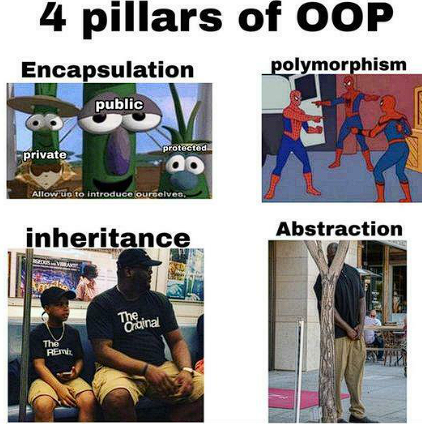

# Lecture 6

## Why Object-Oriented Programming Exists

Traditional programs focus on procedures: step 1, step 2, step 3.
Object-oriented programming (OOP) shifts the focus to objects—things that have data and behavior bundled together.

An object models something from the real world:

- A student

- An employee

- A bank account

Each object knows:

- What it is (its data)

- What it can do (its methods)

This leads us to the four pillars of OOP.

## Pillars of OOP

These pillars are not rules to memorize—they are design principles that help us write safe, reusable, and understandable code.



### Encapsulation

Encapsulation means bundling data and methods together, while restricting direct access to the data.

Instead of letting anyone change an object’s data freely, the object controls how its data is accessed and modified.

Encapsulation answers this question:

`“Who is allowed to touch my data, and how?”`

We will study this pillar in depth.

### Abstraction

Abstraction means showing only what is necessary and hiding implementation details.

Example: `You use a phone without knowing how signals work internally.`

In Java, abstraction is achieved using:

- Methods

- Interfaces

- Abstract classes

Encapsulation supports abstraction by hiding data.

### Inheritance

Inheritance allows one class to reuse and extend another class.

A Manager is an Employee.
It inherits properties and behaviors, then adds more.

Inheritance promotes `code reuse`, but must be used carefully.

### Polymorphism

Polymorphism means one interface, many behaviors.

The same method call can behave differently depending on the object.

This pillar makes programs flexible and extensible.

## What Encapsulation Really Means

- Data is hidden

- Access happens through methods

The object protects itself from invalid states

Instead of this:

```java
employee.salary = -5000;  // dangerous
```

We do this:

```java
employee.setSalary(5000); // controlled
```

## Advantages of Encapsulation

Encapsulation provides several benefits:

- `Data protection` Prevents invalid or unsafe changes
- `Maintainability` Internal changes do not affect external code
- `Readability` Code clearly shows how objects should be used
- `Flexibility` Validation rules can be added without breaking code

Encapsulation turns objects into self-managing units, not passive data containers.

## Access Restriction in Java

Encapsulation is enforced using access (visibility) modifiers.

These modifiers control where fields and methods can be accessed.

## Access Modifiers in Java

Java has four access levels:

### private

- Accessible only within the same class

- Most restrictive

- Used for fields

This is the backbone of encapsulation.

#### No Keyword (Default / Package-Private)

- Accessible within the same package

- Not accessible outside the package

Used when classes are closely related.

#### protected

- Accessible within the same package

- Also accessible in subclasses (even in other packages)

Often used in inheritance.

#### public

- Accessible from anywhere

- Least restrictive

Used for methods that define how the object should be used.

## Getters and Setters (Accessors and Mutators)

Encapsulation does not mean “no access”. It means controlled access.

#### Getter Methods (Accessors)

Used to read private data

Do not modify state

Example:

```java
public int getSalary() {
    return salary;
}
```

#### Setter Methods (Mutators)

Used to change private data

Can validate input

Example:

```java
public void setSalary(int salary) {
    if (salary > 0) {
        this.salary = salary;
    }
}
```

Mutators ensure the object never enters an invalid state.

## Packages in Java

As programs grow, classes must be organized. A package is a namespace that groups related classes together.

Examples:

- model
- service
- util

Packages help with:

- Code organization

- Avoiding name conflicts

- Access control

Example:

```java
package com.company.hr;
```

## Import Statements

When classes are in different packages, Java must be told where to find them. This is done using the import statement.

Example:

```java
import com.company.hr.Employee;
```

Imports:

- Improve readability

- Avoid long package names

- Allow reuse of existing classes
