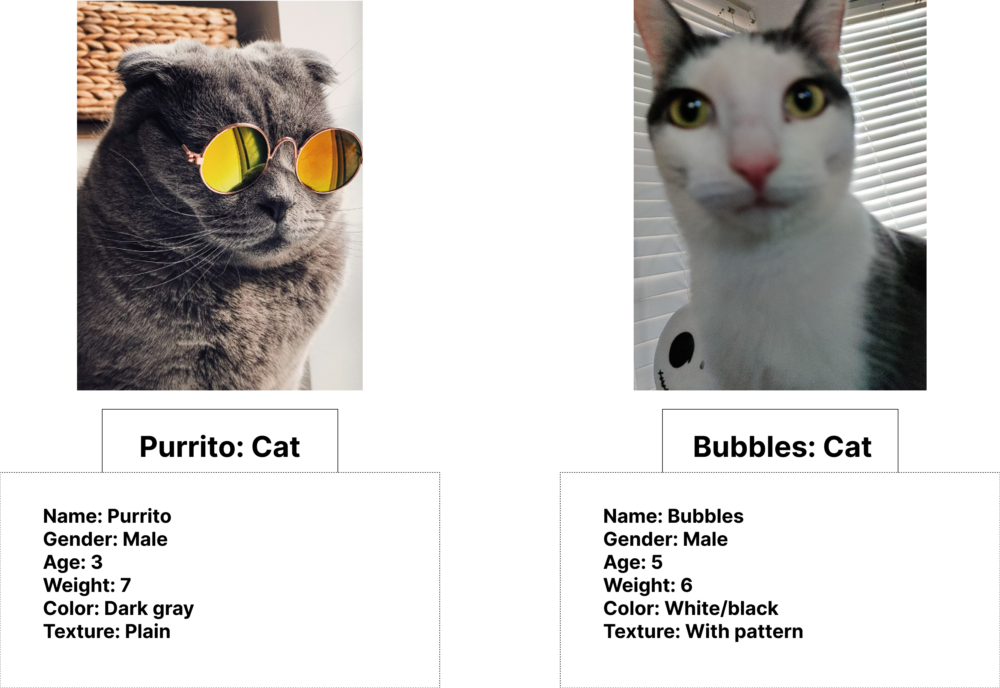

# Introduction to OOP

Most early programming treated software like a recipe: step one, step two, step three. This procedural approach works well for small, well-defined problems—calculating a paycheck, sorting a list of numbers, or converting temperatures—because there’s a clear beginning, middle, and end. The program reads input, performs a fixed sequence of operations, and produces output. Once the result is printed, the program is done.

<br>

That mindset starts to break down when software is expected to _stay alive_ or as the program grows, a lot of features grow.

<br>

Example in an e-commerce site, a customer browses _products_ while another updates their **cart**, a third completes a **payment**, and an **inventory** system adjusts stock levels in the background. These actions overlap in time and affect shared data. A purely procedural breakdown.

**Object-Oriented Programming** is a paradigm based on the concept of wrapping pieces of data, and behavior related to that
data, into special bundles called objects, which are constructed from a set of `blueprints`, defined by a programmer, called
classes.

Let's make Cats as an example.


## Objects and Classes

Every cat has a common set of characteristics—such as name, sex, age, weight, color, and favorite food. In programming terms, these characteristics are the class’s `fields`.
<br>
Cats also share typical behaviors: they breathe, eat, run, sleep, and meow. These behaviors are represented as the class’s `methods`.
<br>
Together, a class’s fields and methods are known as its members, defining both what an object is and what it can do.

**Purrito and Bubbles**



Purrito and bubbles is an instance of the Cat class.
Both has the same set of attributes. The difference is in
values of these attributes: like gender, they have different color, and weighs.
So a _**class**_ is like a `blueprint` that defines the structure for
**objects**, which are concrete instances of that class.

**Real-life analogy**
<br>

- A class is a blueprint.
- An object is a real thing built from that blueprint.

```java
class Student {
    String name;
    int age;
}
```

Creating a stidemt:

```java
Student s1 = new Student();
Student s2 = new Student();
```

Now we have two independent objects.

If you change s1.name, s2.name is unaffected.
Blueprints don’t change when you paint one house.

## Aspects of a Class

Every class answers three questions:

- What does the object know? → fields

- What can the object do? → methods

- How is the object born? → constructor

This mirrors real life.

A student:

- Knows: name, ID, GPA

- Can do: enroll(), drop(), calculateGPA()

- Born via: registration process

## Class vs Instance

**Class**

- Exists once

- Describes structure

- No physical presence

**Instance (Object)**

- Exists in memory

- Holds actual values

- Can change over time

Example:

```java
class Car {
    String color;
}

Car c1 = new Car();
Car c2 = new Car();

c1.color = "Red";
c2.color = "Blue";
```

Same class.
Different state.

## Class Fields and Methods

**Fields (State)**

Fields represent data owned by the object.

```java
class BankAccount {
    double balance;
}
```

Each account has its own balance.

**Methods (Behavior)**

Methods represent actions the object can perform.

```java
class BankAccount {
    double balance;

    void deposit(double amount) {
        balance += amount;
    }
}
```

## Constructors

Objects must start life valid.

A constructor defines how an object begins existence.

```java
class Student {
    String name;
    int age;

    Student(String name, int age) {
        this.name = name;
        this.age = age;
    }
}
```

Now creation is controlled:

```java
Student s = new Student("Ana", 20);
```

Why constructors matter

Without them, objects can exist in half-broken states.

Real-life analogy:<br>
You don’t create a bank account with:

- no owner

- no initial balance

- no account number

Constructors prevent nonsense.

## Interaction Among Classes

Objects are not islands.

They collaborate.

```java
class Course {
    String title;
}

class Student {
    String name;
    Course course;

    void enroll(Course c) {
        course = c;
    }
}
```

Now:

```java
Course oop = new Course();
oop.title = "Object-Oriented Programming";

Student s = new Student("Mark", 19);
s.enroll(oop);
```

## Types of Fields and Methods

Instance fields and methods Belong to each object.

```java
class Dog {
    String name;

    void bark() {
        System.out.println(name + " barks");
    }
}
```

Each dog barks differently.

**Static fields and methods**

Belong to the class itself, not objects.

```java
class University {
    static String schoolName = "Tech University";
}
```

```
System.out.println(University.schoolName);
```

No object required.

**When static makes sense**

- Shared constants

- Utility behavior

- Global facts

Bad use of static turns OOP back into procedural chaos.

## Getters and Setters (Controlled Access to Object State)

Before discussing getters and setters, we must confront a key idea:

`Objects do not exist to store data.`
`Objects exist to protect the meaning of that data.`

**The Problem They Solve**

Consider an Employee object.

An employee’s salary:

- Must not be negative

- Must change only through valid operations

- Must remain meaningful over time

If fields were public:

```
employee.salary = -5000;
```

The compiler allows it.

The program runs.

The object is now lying.

Getters and setters exist to prevent this.

## What Is a Getter?

A getter is a method that allows controlled reading of a private field.

Example:
```java
public int getSalary() {
    return salary;
}
```

Key points:

- It does not expose the field itself

- It allows the class to decide how data is read

- It preserves encapsulation

A getter answers the question:

*“What information am I allowed to know about this object?”*

A proper getter:

- May format data

- May compute derived values

- Does not always return raw fields

## What Is a Setter?

A setter is a method that allows controlled modification of a private field.

Example:
```java
public void setSalary(int salary) {
    if (salary < 0) {
        return;
    }
    this.salary = salary;
}
```

Key points:

- It protects the object from invalid values

- It enforces rules every time the field changes

- It centralizes validation logic

A setter answers:

*“Under what conditions may this object change?”*

## Why Not Access Fields Directly?

Direct access breaks object integrity.

```java
employee.salary += 1000000;  // bypasses all rules
```

This creates:

- Inconsistent states

- Hidden bugs

- Objects that cannot defend themselves

Encapsulation without getters and setters is incomplete.

A proper setter:

- Validates input

- Enforces invariants

- May reject or transform values